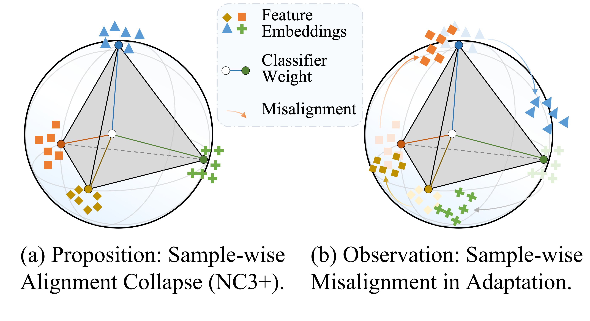
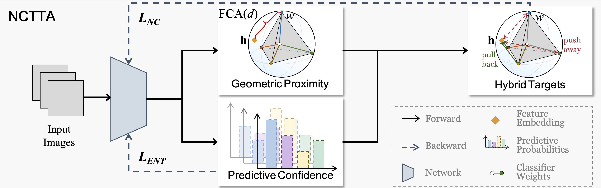

# Neural Collapse in Test Time Adaptation (NCTTA)
<p align="center">

<a href="https://github.com/Cevaaa/NCTTA">
  
</a>

<a href="https://github.com/Cevaaa/NCTTA">
  
</a>

<a href="https://arxiv.org/abs/2512.10421">
  
</a>


This is the official implementation of [Neural Collapse in Test Time Adaptation](https://arxiv.org/abs/2512.10421) on CVPR 2026. We propose NCTTA as a novel algrithm for test-time adaption.


## Overview

  Test-Time Adaptation (TTA) enhances model robustness to out-of-distribution (OOD) data by updating the model online during inference, yet existing methods lack theoretical insights into the fundamental causes of performance degradation under domain shifts. Recently, Neural Collapse (NC) has been proposed as an emergent geometric property of deep neural networks (DNNs), providing valuable insights for TTA. In this work, we extend NC to the sample-wise level and discover a novel phenomenon termed Sample-wise Alignment Collapse (NC3+), demonstrating that a sample's feature embedding, obtained by a trained model, aligns closely with the corresponding classifier weight. Building on NC3+, we identify that the performance degradation stems from sample-wise misalignment in adaptation which exacerbates under larger distribution shifts. This indicates the necessity of realigning the feature embeddings with their corresponding classifier weights. However, the misalignment makes pseudo-labels unreliable under domain shifts. To address this challenge, we propose NCTTA, a novel feature-classifier alignment method with hybrid targets to mitigate the impact of unreliable pseudo-labels, which blends geometric proximity with predictive confidence. Extensive experiments demonstrate the effectiveness of NCTTA in enhancing robustness to domain shifts. For example, NCTTA outperforms Tent by 14.52\% on ImageNet-C. 

<p align="center">
  
</p>

Our main contributions are as follows: 

+ NC theory is, for the first time, extended to the sample-wise level through Sample-wise Alignment Collapse (NC3+), validated theoretically and empirically.
+ Comprehensive empirical evidence is provided to show that the performance degradation of pre-trained models on OOD data originates from sample-wise misalignment.
+ A novel **NC**-guided **TTA** (NCTTA) method is proposed to effectively promote alignment between sample feature embeddings and their corresponding classifier weights.
+ Extensive experiments demonstrate the effectiveness of NCTTA. For instance, it achieves 78.30\% average accuracy on CIFAR-10-C under severe corruption and 66.61\% on ImageNet-C, outperforming prior methods.

<p align="center">
  
</p>

## Installation

Our codebase is built upon [TTAB](https://github.com/LINs-lab/ttab).  
Before running the code, please install the required environment:

```bash
# Clone this repo
git clone https://github.com/Cevaaa/NCTTA.git
cd NCTTA

# Create a conda environment
conda create -n nctta python=3.10 -y
conda activate nctta
pip install -r requirements.txt
```

To run a baseline test, please prepare the corresponding pre-trained checkpoints for the base model and place them in `pretrain/ckpt/`.  
You also need to prepare the required datasets in advance.  

For running examples, please refer to [TTAB](https://github.com/LINs-lab/ttab).

## Additional Algorithms

In addition to the algorithms already implemented in [TTAB](https://github.com/LINs-lab/ttab), we further implement the following methods:

- **Entropy is not Enough for Test-Time Adaptation: From the Perspective of Disentangled Factors** (DeYO, [Lee et al., 2024](https://arxiv.org/abs/2403.07366))  
- **COME: Test-time Adaptation by Conservatively Minimizing Entropy** (COME, [Zhan et al., 2025](https://openreview.net/pdf?id=506BjJ1ziZ))  
- **Adapt in the Wild: Test-Time Entropy Minimization with Sharpness and Feature Regularization** (SAR2, [Niu et al., 2025](https://arxiv.org/abs/2509.04977))  
- **Decoupled Entropy Minimization** (AdaDEM, [Ma et al., 2025](https://arxiv.org/abs/2511.03256))  
- **Uncertainty-Calibrated Test-Time Model Adaptation without Forgetting** (EATAC, [Tan et al., 2025](https://arxiv.org/abs/2403.11491))  

## Bibliography
If you find this repository helpful for your project, please consider citing:
```
@article{chen2025neural,
  title={Neural Collapse in Test-Time Adaptation},
  author={Chen, Xiao and Du, Zhongjing and Huang, Jiazhen and Jiang, Xu and Lu, Li and Jiang, Jingyan and Wang, Zhi},
  journal={arXiv preprint arXiv:2512.10421},
  year={2025}
}
```

## Acknowledgment

This repo is developed upon [TTAB](https://github.com/LINs-lab/ttab).

For any additional questions, feel free to email [chen-x25@mails.tsinghua.edu.cn](mailto:chen-x25@mails.tsinghua.edu.cn).